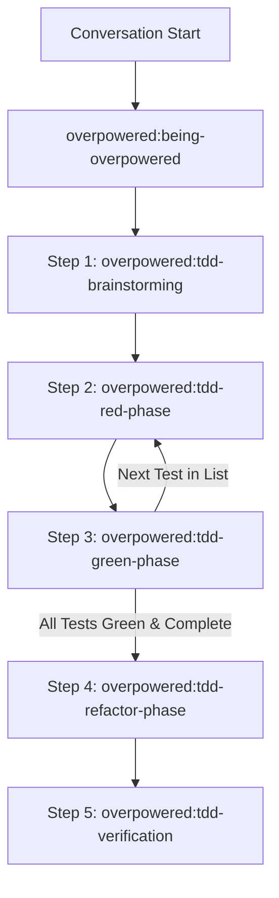

<SUBAGENT-STOP>
If you were dispatched as a subagent to execute a specific task, ignore this skill.
</SUBAGENT-STOP>

<EXTREMELY-IMPORTANT>
If you think there is even a 1% chance an overpowered TDD skill might apply to what you are doing, you ABSOLUTELY MUST invoke the skill.

IF A SKILL APPLIES TO YOUR TASK, YOU DO NOT HAVE A CHOICE. YOU MUST USE IT.

This is not negotiable. You cannot rationalize your way out of this.
</EXTREMELY-IMPORTANT>

## The Rule

**Invoke relevant or requested overpowered TDD skills BEFORE any response or action** — including clarifying questions, exploring the codebase, or checking files. If it turns out wrong for the situation, you don't have to use it.

**Before starting any task (bugfix or feature):** you must execute the skills sequentially:

Then announce "Using [skill] to [purpose]" and follow the skill exactly. If it has a checklist, create a todo per item.

## Skill Sequence Overview

1. **`overpowered:tdd-brainstorming`**
   - Understand requirements.
   - Create a structured **Test List** (scenarios, inputs, expected outcomes).
   - Identify if **preparatory refactorings** are needed to make the change easy. (Note: These must be done and committed separately *before* starting the feature work, and never mixed into the final feature PR).
   - Get user approval on the Test List.
2. **`overpowered:tdd-red-phase`**
   - Pick the next item from the Test List.
   - Write ONE minimal failing test. No production code changes!
   - Run the test suite and verify that the test fails in the expected way.
3. **`overpowered:tdd-green-phase`**
   - Write the absolute minimal production code to pass the failing test.
   - Apply TDD strategies: Fake It, Obvious Implementation, or Triangulation.
   - Run the test suite and verify that the new test and all existing tests pass.
   - Commit the passing incremental change.
   - Loop back to `tdd-red-phase` for the next test.
4. **`overpowered:tdd-refactor-phase`**
   - Refactor production code and test code separately to improve names, clean up duplication, and decouple components.
   - Verify tests remain green at every step. Commit refactorings separately.
5. **`overpowered:tdd-verification`**
   - Run the full test suite.
   - Run the Testing Anti-Patterns checklist to make sure no mocks or test-only methods violate TDD principles.
   - Provide a final walkthrough.

## Red Flags - You are rationalizing!

These thoughts mean STOP—you're rationalizing:

| Thought | Reality |
|---------|---------|
| "This is just a simple question" | Questions are tasks. Check for skills. |
| "I need more context first" | Skill check comes BEFORE clarifying questions. |
| "Let me explore the codebase first" | Skills tell you HOW to explore. Check first. |
| "I can check git/files quickly" | Files lack conversation context. Check for skills. |
| "Let me gather information first" | Skills tell you HOW to gather information. |
| "This doesn't need a formal skill" | If a skill exists, use it. |
| "I remember this skill" | Skills evolve. Read current version. |
| "This doesn't count as a task" | Action = task. Check for skills. |
| "The skill is overkill" | Simple things become complex. Use it. |
| "I'll just do this one thing first" | Check BEFORE doing anything. |
| "This feels productive" | Undisciplined action wastes time. Skills prevent this. |
| "I know what that means" | Knowing the concept ≠ using the skill. Invoke it. |

## User Instructions

User instructions (CLAUDE.md, AGENTS.md, GEMINI.md, etc, direct requests) take precedence over skills, which in turn override default behavior. Only skip skill workflows or instructions when your human partner has explicitly told you to.
