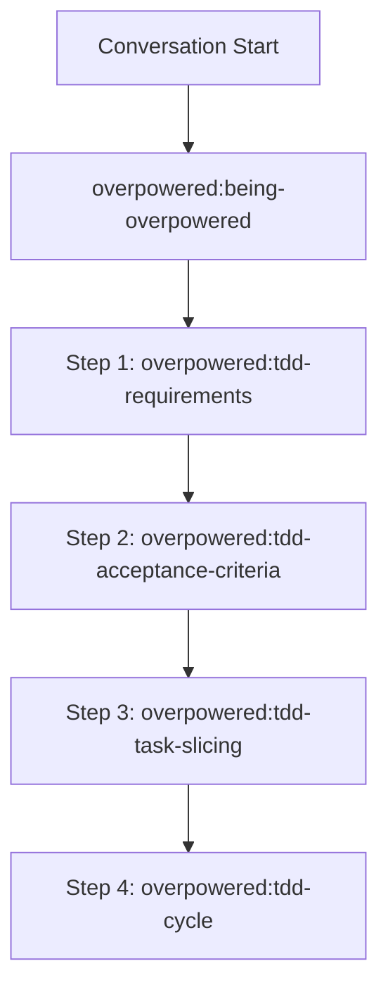

<SUBAGENT-STOP>
If you were dispatched as a subagent to execute a specific task, ignore this skill.
</SUBAGENT-STOP>

<EXTREMELY-IMPORTANT>
If you think there is even a 1% chance an overpowered TDD skill might apply to what you are doing, you ABSOLUTELY MUST invoke the skill.

IF A SKILL APPLIES TO YOUR TASK, YOU DO NOT HAVE A CHOICE. YOU MUST USE IT.

This is not negotiable. You cannot rationalize your way out of this.
</EXTREMELY-IMPORTANT>

## The Rule

**Invoke relevant or requested overpowered TDD skills BEFORE any response or action** — including clarifying questions, exploring the codebase, or checking files. If it turns out wrong for the situation, you don't have to use it.

**Before starting any task (bugfix or feature):** you must execute the skills sequentially:

Then announce "Using [skill] to [purpose]" and follow the skill exactly. If it has a checklist, create a todo per item.

## Skill Sequence Overview

1. **`overpowered:tdd-requirements`**
   - Interactively explore project context, requirements, and constraints with the human partner.
   - Ask clarifying questions one at a time and employ interactive techniques (such as `/grill-me`).
2. **`overpowered:tdd-acceptance-criteria`**
   - Interactively define and document concrete acceptance criteria (success criteria, happy paths, error conditions, edge cases).
   - Get explicit approval from the human partner before proceeding.
3. **`overpowered:tdd-task-slicing`**
   - Interactively break down the requirements and criteria into minimal vertical slices (one behavioral capability at a time).
   - Establish whether preparatory refactorings are needed.
   - **CRITICAL RULE:** Preparatory refactorings/simplifications must be executed and committed *first* separately using existing tests. They must **never** be part of the final feature implementation PR/commit.
   - Get human partner approval on the vertical slices list.
4. **`overpowered:tdd-cycle`**
   - Execute the Red-Green-Refactor loop iteratively for each vertical slice.
   - Follow the testing anti-patterns guidelines and final verification checks.

## Red Flags - You are rationalizing!

These thoughts mean STOP—you're rationalizing:

| Thought | Reality |
|---------|---------|
| "This is just a simple question" | Questions are tasks. Check for skills. |
| "I need more context first" | Skill check comes BEFORE clarifying questions. |
| "Let me explore the codebase first" | Skills tell you HOW to explore. Check first. |
| "I can check git/files quickly" | Files lack conversation context. Check for skills. |
| "Let me gather information first" | Skills tell you HOW to gather information. |
| "This doesn't need a formal skill" | If a skill exists, use it. |
| "I remember this skill" | Skills evolve. Read current version. |
| "This doesn't count as a task" | Action = task. Check for skills. |
| "The skill is overkill" | Simple things become complex. Use it. |
| "I'll just do this one thing first" | Check BEFORE doing anything. |
| "This feels productive" | Undisciplined action wastes time. Skills prevent this. |
| "I know what that means" | Knowing the concept ≠ using the skill. Invoke it. |

## User Instructions

User instructions (CLAUDE.md, AGENTS.md, GEMINI.md, etc, direct requests) take precedence over skills, which in turn override default behavior. Only skip skill workflows or instructions when your human partner has explicitly told you to.
