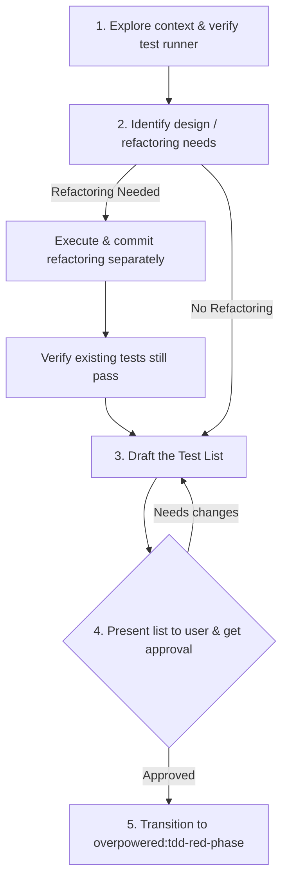

# TDD Brainstorming & Planning

Before writing any code or tests, you must understand the requirements, plan the test scenarios, and determine if the system needs preparatory refactoring.

<HARD-GATE>
Do NOT write any code, create test files, or make edits until you have presented a Test List and the user has approved it.
</HARD-GATE>

## Checklist

You MUST create a task for each of these items and complete them in order:

1. **Explore context** — Check the codebase, current tests, and verify the test runner runs successfully.
2. **Identify design & refactoring needs** — Check if existing code needs to be restructured/simplified to make adding the new feature easy.
   - **CRITICAL RULE:** Preparatory refactorings must be implemented and committed *separately* using existing tests *before* writing the new feature. They must **never** be mixed in the final feature PR/commit.
3. **Draft the Test List** — Brainstorm a list of test cases (happy path, edge cases, error handling, validation, boundary values).
4. **Obtain user approval** — Present the Test List to the human partner and get explicit approval.
5. **Transition** — Once approved, invoke the `overpowered:tdd-red-phase` skill to write the first failing test.

## Process Flow

## The Test List

A **Test List** is a living document (written in a scratchpad, comments, or a task file) of everything you need to verify.
- Be concrete: specify input values and expected outputs.
- Include:
  - Happy paths (success cases).
  - Validation rules (e.g. empty inputs, invalid formats).
  - Edge cases (null values, boundaries, empty lists).
  - Error conditions (network failures, DB exceptions, invalid state transitions).
- You will pick exactly **one** test from this list to implement first, and check them off one by one.
- If you think of new edge cases during implementation, write them down on the Test List immediately instead of breaking your flow.

## Preparatory Refactoring Rule

> "Make the change easy (warning: this might be hard), then make the easy change." — Kent Beck

If implementing a feature requires modifying a component that is poorly structured, too coupled, or lacks clean extension points:
1. Plan the refactoring steps first.
2. Run the existing tests to ensure they are green.
3. Perform the refactoring without adding any new behavior.
4. Run tests to confirm no regressions.
5. Commit the refactoring.
6. Push/merge this refactoring or keep it as a separate PR. It must **never** be part of the final feature implementation PR.
7. Resume feature implementation from a clean, refactored base.

## Key Principles

- **No speculative implementation** — Do not outline functions or interfaces in production code. Only list them in your Test List.
- **Decompose early** — If the feature is large, break it down into smaller sub-features, each with its own Test List.
- **YAGNI** — Do not plan test cases for features that are not requested.
