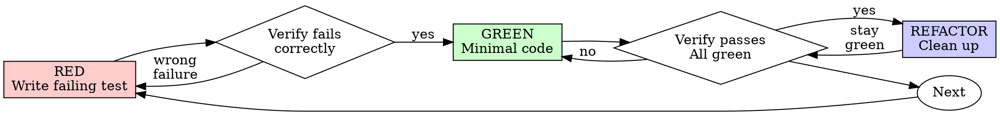

# Test-Driven Development (TDD)

## Overview

Write the test first. Watch it fail. Write minimal code to pass.

**Core principle:** If you didn't watch the test fail, you don't know if it tests the right thing.

**Violating the letter of the rules is violating the spirit of the rules.**

### Vertical Slicing

Work in **vertical slices** (one behavioral capability at a time) rather than horizontal slices (all tests first, all production code second).

| Horizontal Slicing (❌ Bad) | Vertical Slicing (✅ Good) |
|---|---|
| 1. Write all tests for the entire feature | 1. Write ONE test for one simple capability (RED) |
| 2. Implement all production code in bulk | 2. Write minimal code to pass that test (GREEN) |
| 3. Run tests and debug everything | 3. Refactor, then repeat for the next test |

Writing tests in bulk results in tests that verify imagined or mocked behavior rather than observed behavior, increasing context complexity and lead times.

## When to Use

**Always:**
- New features
- Bug fixes
- Refactoring
- Behavior changes

**Exceptions (ask your human partner):**
- Throwaway prototypes
- Generated code
- Configuration files

Thinking "skip TDD just this once"? Stop. That's rationalization.

**Need to explore or prototype? Use a Spike:**
If you don't know the design yet, run a time-boxed **Spike** (exploratory prototyping). Write whatever code is necessary to learn. *Crucial:* Once you understand the design, **delete or discard the spike code completely**, checkout clean files, and implement the production version using TDD.

## Test Strategy

Organize your tests by scope and resource usage to keep the test suite fast and reliable:
- **Unit (Small):** Tests pure logic, calculations, and algorithms. No file system, database, or network I/O. Execution time: milliseconds. (Aim for ~80% of tests).
- **Integration (Medium):** Tests boundaries, databases, or API contracts. Limited to local resources/in-memory databases. Execution time: seconds. (Aim for ~15% of tests).
- **End-to-End (Large):** Tests critical user flows across the entire stack. Uses external services or browsers. Execution time: minutes. (Keep to <5%, only for critical paths).

## The Iron Law

```
NO PRODUCTION CODE WITHOUT A FAILING TEST FIRST
```

Write code before the test? Delete it. Start over.

**No exceptions:**
- Don't keep it as "reference"
- Don't "adapt" it while writing tests
- Don't look at it
- Delete means delete

Implement fresh from tests. Period.

*(Remember the **Beyonce Rule**: If you liked it—if the behavior is important enough to exist—you should have put a test on it. No behavior is safe without coverage.)*

## Red-Green-Refactor



### 0. Preparation: The Test List

Before writing any tests, create a **Test List** (e.g., in a scratchpad, comments, or a task file):
- Write down all the requirements, edge cases, and scenarios you need to cover.
- Pick exactly **one** test from the list to implement first.
- If you think of new edge cases or refactoring ideas *during* the cycle, immediately add them to the list instead of switching focus.
- Cross off completed tests as you go. This keeps you focused and ensures no edge cases are forgotten.

### RED - Write Failing Test

Write one minimal test showing what should happen.

<Good>
```typescript
test('retries failed operations 3 times', async () => {
  let attempts = 0;
  const operation = () => {
    attempts++;
    if (attempts < 3) throw new Error('fail');
    return 'success';
  };

  const result = await retryOperation(operation);

  expect(result).toBe('success');
  expect(attempts).toBe(3);
});
```
Clear name, tests real behavior, one thing
</Good>

<Bad>
```typescript
test('retry works', async () => {
  const mock = jest.fn()
    .mockRejectedValueOnce(new Error())
    .mockRejectedValueOnce(new Error())
    .mockResolvedValueOnce('success');
  await retryOperation(mock);
  expect(mock).toHaveBeenCalledTimes(3);
});
```
Vague name, tests mock not code
</Bad>

**Requirements:**
- One behavior
- Clear name
- Real code (no mocks unless unavoidable)

### Verify RED - Watch It Fail

**MANDATORY. Never skip.**

```bash
npm test path/to/test.test.ts
```

Confirm:
- Test fails (assertion failure, compile error, or ReferenceError due to missing code, not test runner configuration errors)
- Failure message is expected
- Fails because feature missing (not typos)

**Test passes?** You're testing existing behavior. Fix test.

**Test errors?** Fix error, re-run until it fails correctly.

### GREEN - Minimal Code

Write simplest code to pass the test. Use one of the three classic TDD strategies:
- **Fake It ('til you make it)**: Return a hardcoded constant first. This verifies that your test assertion works and that you can transition from red to green with minimal variables.
- **Obvious Implementation**: Write the real implementation only if the solution is completely trivial.
- **Triangulation**: If you aren't sure how to generalize, write a second test with different inputs/outputs. Only generalize the implementation once you have multiple tests forcing it, rather than speculating.

<Good>
```typescript
// Example of "Obvious Implementation":
async function retryOperation<T>(fn: () => Promise<T>): Promise<T> {
  for (let i = 0; i < 3; i++) {
    try {
      return await fn();
    } catch (e) {
      if (i === 2) throw e;
    }
  }
  throw new Error('unreachable');
}
```
Just enough to pass
</Good>

**Example of "Fake It ('til you make it)" progression:**
If you aren't sure how to structure the retry logic, you could first return a hardcoded success value to verify the test assertion:
```typescript
// 1. Fake It (hardcoded to pass the first test)
async function retryOperation<T>(fn: () => Promise<T>): Promise<T> {
  return 'success' as any;
}
```
Then, write a second test where `fn` fails once before succeeding. This forces you to generalize the code and write the actual retry logic (Triangulation).

<Bad>
```typescript
async function retryOperation<T>(
  fn: () => Promise<T>,
  options?: {
    maxRetries?: number;
    backoff?: 'linear' | 'exponential';
    onRetry?: (attempt: number) => void;
  }
): Promise<T> {
  // YAGNI
}
```
Over-engineered
</Bad>

Don't add features, refactor other code, or "improve" beyond the test.

### Verify GREEN - Watch It Pass

**MANDATORY.**

```bash
npm test path/to/test.test.ts
```

Confirm:
- Test passes
- Other tests still pass
- Output pristine (no errors, warnings)

**Test fails?** Fix code, not test.

**Other tests fail?** Fix now.

### REFACTOR - Clean Up

After green only:
- Remove duplication
- Improve names
- Extract helpers
- **Refactor test code**: Test code is first-class code. Keep it clean, readable, and maintainable (remove test duplication, simplify setup). *Crucial:* Do not refactor tests and production code at the same time. Refactor production code while tests are green and stable, verify correctness, and then refactor test code (or vice-versa).

Keep tests green. Don't add behavior.

### Repeat

Next failing test for next feature.

## Good Tests

| Quality | Good | Bad |
|---------|------|-----|
| **Minimal** | One thing. "and" in name? Split it. | `test('validates email and domain and whitespace')` |
| **Clear** | Name describes behavior | `test('test1')` |
| **Shows intent** | Demonstrates desired API | Obscures what code should do |
| **Outcome-focused** | Verifies outputs and state changes. Survives internal refactoring. | Mocks internal collaborators or asserts call sequences. Breaks when internals change. |
| **Covered** | Important behavior/edge cases have explicit tests (if it can break, test it). | Assuming code is safe because of general code coverage metrics. |

## Why Order Matters

**"I'll write tests after to verify it works"**

Tests written after code pass immediately. Passing immediately proves nothing:
- Might test wrong thing
- Might test implementation, not behavior
- Might miss edge cases you forgot
- You never saw it catch the bug

Test-first forces you to see the test fail, proving it actually tests something.

**"I already manually tested all the edge cases"**

Manual testing is ad-hoc. You think you tested everything but:
- No record of what you tested
- Can't re-run when code changes
- Easy to forget cases under pressure
- "It worked when I tried it" ≠ comprehensive

Automated tests are systematic. They run the same way every time.

**"Deleting X hours of work is wasteful"**

Sunk cost fallacy. The time is already gone. Your choice now:
- Delete and rewrite with TDD (X more hours, high confidence)
- Keep it and add tests after (30 min, low confidence, likely bugs)

The "waste" is keeping code you can't trust. Working code without real tests is technical debt.

**"TDD is dogmatic, being pragmatic means adapting"**

TDD IS pragmatic:
- Finds bugs before commit (faster than debugging after)
- Prevents regressions (tests catch breaks immediately)
- Documents behavior (tests show how to use code)
- Enables refactoring (change freely, tests catch breaks)

"Pragmatic" shortcuts = debugging in production = slower.

**"Tests after achieve the same goals - it's spirit not ritual"**

No. Tests-after answer "What does this do?" Tests-first answer "What should this do?"

Tests-after are biased by your implementation. You test what you built, not what's required. You verify remembered edge cases, not discovered ones.

Tests-first force edge case discovery before implementing. Tests-after verify you remembered everything (you didn't).

30 minutes of tests after ≠ TDD. You get coverage, lose proof tests work.

## Common Rationalizations

| Excuse | Reality |
|--------|---------|
| "Too simple to test" | Simple code breaks. Test takes 30 seconds. |
| "I'll test after" | Tests passing immediately prove nothing. |
| "Tests after achieve same goals" | Tests-after = "what does this do?" Tests-first = "what should this do?" |
| "Already manually tested" | Ad-hoc ≠ systematic. No record, can't re-run. |
| "Deleting X hours is wasteful" | Sunk cost fallacy. Keeping unverified code is technical debt. |
| "Keep as reference, write tests first" | You'll adapt it. That's testing after. Delete means delete. |
| "Need to explore first" | Fine. Throw away exploration, start with TDD. |
| "Test hard = design unclear" | Listen to test. Hard to test = hard to use. |
| "TDD will slow me down" | TDD faster than debugging. Pragmatic = test-first. |
| "Manual test faster" | Manual doesn't prove edge cases. You'll re-test every change. |
| "Existing code has no tests" | You're improving it. Add tests for existing code. |

## Red Flags - STOP and Start Over

- Code before test
- Test after implementation
- Test passes immediately
- Can't explain why test failed
- Tests added "later"
- Rationalizing "just this once"
- "I already manually tested it"
- "Tests after achieve the same purpose"
- "It's about spirit not ritual"
- "Keep as reference" or "adapt existing code"
- "Already spent X hours, deleting is wasteful"
- "TDD is dogmatic, I'm being pragmatic"
- "This is different because..."

**All of these mean: Delete code. Start over with TDD.**

## Example: Bug Fix

**Bug:** Empty email accepted

**RED**
```typescript
test('rejects empty email', async () => {
  const result = await submitForm({ email: '' });
  expect(result.error).toBe('Email required');
});
```

**Verify RED**
```bash
$ npm test
FAIL: expected 'Email required', got undefined
```

**GREEN**
```typescript
function submitForm(data: FormData) {
  if (!data.email?.trim()) {
    return { error: 'Email required' };
  }
  // ...
}
```

**Verify GREEN**
```bash
$ npm test
PASS
```

**REFACTOR**
Extract validation for multiple fields if needed.

## Verification Checklist

Before marking work complete:

- [ ] Every new function/method has a test
- [ ] Watched each test fail before implementing
- [ ] Each test failed for expected reason (feature missing, not typo)
- [ ] Wrote minimal code to pass each test
- [ ] All tests pass
- [ ] Output pristine (no errors, warnings)
- [ ] Tests use real code (mocks only if unavoidable)
- [ ] Edge cases and errors covered

Can't check all boxes? You skipped TDD. Start over.

## When Stuck

| Problem | Solution |
|---------|----------|
| Don't know how to test | Write wished-for API. Write assertion first. Ask your human partner. |
| Test too complicated | Design too complicated. Simplify interface. |
| Must mock everything | Code too coupled (design smell). Use dependency injection to decouple dependencies. Prefer testing with real collaborators (sociable tests) rather than mocking. If mocks are unavoidable, mock boundaries/interfaces, not internal implementation details. |
| Test setup huge | Extract helpers. Still complex? Simplify design. |

## Debugging Integration

Bug found? Write failing test reproducing it. Follow TDD cycle. Test proves fix and prevents regression.

Never fix bugs without a test.

## Testing Anti-Patterns

When adding mocks or test utilities, read [testing-anti-patterns.md](testing-anti-patterns.md) to avoid common pitfalls:
- Testing mock behavior instead of real behavior
- Adding test-only methods to production classes
- Mocking without understanding dependencies

## Final Rule

```
Production code → test exists and failed first
Otherwise → not TDD
```

No exceptions without your human partner's permission.
